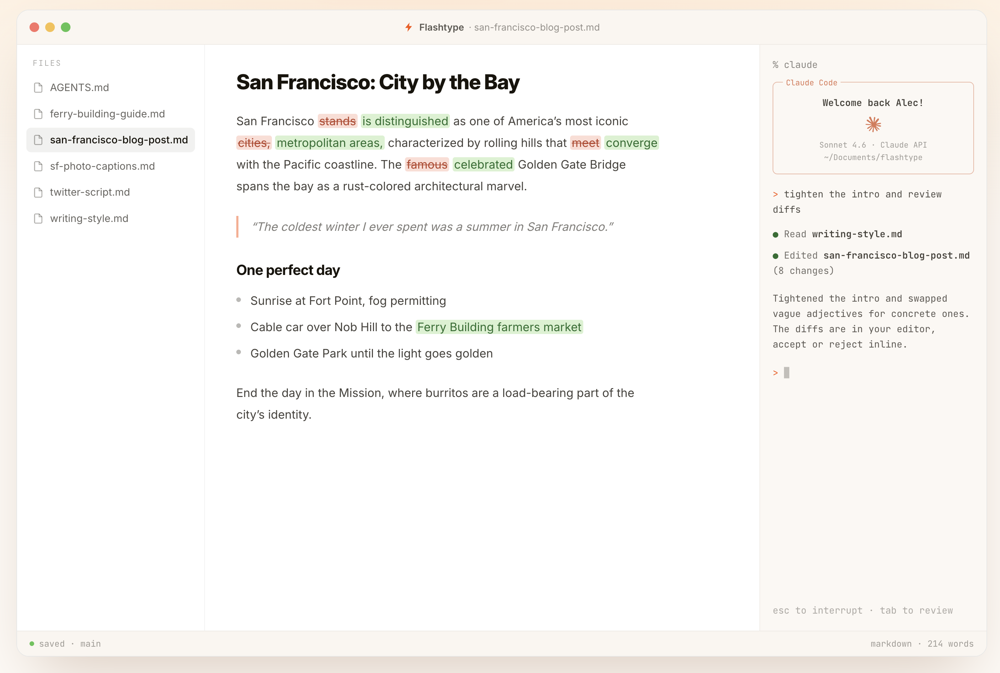

# Flashtype

### The markdown editor for Claude & Codex

Agents edit. You review the diff. Nothing lands without you.

[Download for macOS](https://flashtype.com) - [Website](https://flashtype.com) - [Lix](https://lix.dev) - [Discord](https://discord.gg/gdMPPWy57R)



## Write Markdown With Agents In The Loop

Flashtype is a WYSIWYG markdown editor with Claude Code and Codex built in. Point it at a folder, open the `.md` files you already have, and run coding agents against the same files from a real terminal beside your document.

When an agent edits, Flashtype shows the change as an inline diff with word-level precision. Accept or reject each change before it lands, browse document history, and restore earlier versions when you need to.

## Features

| Feature                     | Description                                                                                                                                 |
| --------------------------- | ------------------------------------------------------------------------------------------------------------------------------------------- |
| Local markdown files        | Open `.md` and `.markdown` files from your disk. No imports, sync step, or duplicate document format.                                       |
| Claude & Codex terminal     | Run CLI agents next to the document they are editing, with no copy-paste round trip.                                                        |
| Inline diffs                | Review agent edits in the editor and accept or reject changes before they land.                                                             |
| Version history             | Every edit becomes a checkpoint you can inspect and restore.                                                                                |
| Markdown as source of truth | Keep lossless markdown that works with GitHub, ChatGPT, Discord, docs, and plain text tools.                                                |
| Lix-powered version control | Built on the [Lix SDK](https://lix.dev), an embeddable version control system for app-level history, branches, diffs, and change proposals. |

## Download

Download Flashtype for macOS at [flashtype.com](https://flashtype.com).

## Development

```sh
git clone https://github.com/opral/flashtype.git
cd flashtype
pnpm install
pnpm run dev
```

Useful commands:

| Command              | Description                                    |
| -------------------- | ---------------------------------------------- |
| `pnpm run dev`       | Start the Electron app with the Vite renderer. |
| `pnpm run dev:web`   | Start the browser version.                     |
| `pnpm run build`     | Build the app.                                 |
| `pnpm test`          | Run unit tests.                                |
| `pnpm run test:e2e`  | Run Playwright end-to-end tests.               |
| `pnpm run typecheck` | Check TypeScript.                              |
| `pnpm run lint`      | Run oxlint.                                    |

The marketing site lives in [`website`](./website).

## Why Lix?

Flashtype is also a real-world showcase for [Lix](https://lix.dev): version control embedded directly into an application instead of bolted on outside it.

| Lix capability     | How Flashtype uses it                                              |
| ------------------ | ------------------------------------------------------------------ |
| History            | Track every document edit and restore earlier versions.            |
| Branches           | Let agents work in isolated branches before changes are accepted.  |
| Diffs              | Show granular inline accept/reject UI for markdown changes.        |
| Change proposals   | Keep humans in control of what lands.                              |
| Filesystem backend | Persist desktop documents as real files in a Lix-backed workspace. |

## License

Flashtype is released under the [MIT License](./LICENSE).
