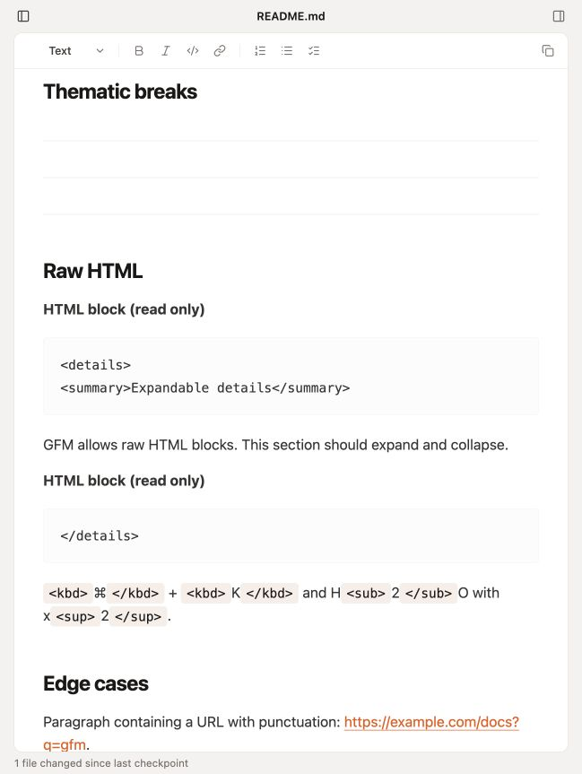
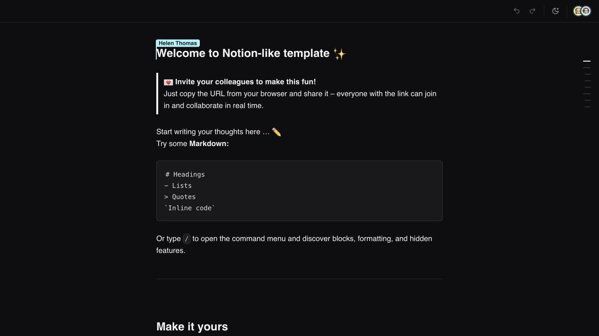
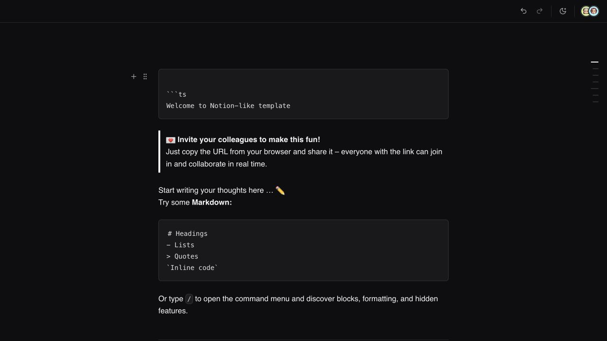

# Atelier Notion-like Markdown writing audit

Date: 2026-07-11

## Audit scope

- Surface: Atelier Markdown editor at `http://127.0.0.1:4176/`
- Comparator: Tiptap Notion-like template and official Tiptap extension behavior
- Goal: determine whether every supported CommonMark/GFM construct also has a coherent, keyboard-first, Notion-like authoring experience
- Method: live browser inspection, a live fenced-code probe in the Tiptap reference, existing automated tests, a read-only Tiptap/Happy DOM behavior harness, and source review by independent agents

## Overall verdict

Atelier has broad **GFM parsing and round-trip coverage**, but it does **not yet provide Notion-like writing across that surface**. Reading existing Markdown is much stronger than creating and navigating it. Fenced code and multiline code editing are P0 gaps; blockquote exit, table navigation, block-boundary cursor movement, and list edge cases are P1 gaps.

## Evidence

### 1. Atelier current Markdown surface



Health: **partial**. Existing GFM renders cleanly, but rendered coverage does not establish authoring coverage. The test interaction also caused the fixture to persist a canonicalized Markdown form, exposing source-fidelity drift even after the visible edit was undone.

### 2. Tiptap Notion-like reference



Health: **strong baseline**. The reference exposes Markdown shortcuts, a slash menu, block handles, collaborative presence, task lists, and interactive tables as one writing system.

### 3. Fenced-code reference probe



Health: **passes the core conversion**. Enter after a `ts` fence produced a code block carrying the TypeScript language. The shared reference probe was intentionally limited after proving conversion; the remaining expected behavior below is grounded in official Tiptap source/documentation.

## Behavior matrix

| Writing behavior               | Tiptap/Notion-like expectation                                                                   | Atelier result                                                                                              | Health                     | Priority |
| ------------------------------ | ------------------------------------------------------------------------------------------------ | ----------------------------------------------------------------------------------------------------------- | -------------------------- | -------- |
| ` ```ts` + Enter               | Convert the paragraph to a `codeBlock` with `language: ts`                                       | No code-fence input rule exists; fence remains text                                                         | Fail                       | P0       |
| Enter inside code              | Insert a newline and keep one code block                                                         | Global Enter calls `splitBlock()`; harness split `abcdef` into two code blocks                              | Fail                       | P0       |
| Exit code                      | Triple Enter exits; ArrowDown at final line exits/creates a paragraph                            | No `newlineInCode`, triple-Enter, `exitCode`, or ArrowDown boundary handler                                 | Fail                       | P1       |
| Empty code + Backspace         | Convert back to a normal paragraph                                                               | No code-specific Backspace handling                                                                         | Fail                       | P1       |
| Tab in code                    | Make an explicit product choice; stock Tiptap leaves Tab unhandled unless configured             | Unhandled, with no stated behavior or test                                                                  | Partial                    | P2       |
| `# ` through `###### `         | Convert to heading levels 1–6                                                                    | Implemented and tested                                                                                      | Pass                       | —        |
| `- ` / `* ` list               | Start bullet list                                                                                | Implemented and tested                                                                                      | Pass                       | —        |
| `+ ` list                      | Start bullet list                                                                                | Missing                                                                                                     | Fail                       | P2       |
| `1. ` / custom numeric start   | Start ordered list and preserve start                                                            | Implemented and tested                                                                                      | Pass                       | —        |
| Enter in list                  | Split item; empty item exits                                                                     | Core paths implemented and tested                                                                           | Pass                       | —        |
| Tab / Shift-Tab in list        | Nest/outdent predictably across bullets, ordered lists, tasks, ranges, and deep trees            | Simple collapsed-caret bullet cases pass; mixed/deep/range cases and top-level Shift-Tab are incomplete     | Partial                    | P1       |
| Task shortcut                  | `[ ] ` / `[x] ` creates task; Enter creates unchecked sibling                                    | Implemented, including GFM `- [ ]` persistence                                                              | Pass                       | —        |
| Task checkbox keyboard/a11y    | Checkbox has a useful label and predictable focus/toggle behavior                                | Checkbox node view has no accessible label; live keyboard path is unverified                                | Fail                       | P1       |
| `> ` blockquote                | Start quote                                                                                      | Implemented and tested                                                                                      | Pass                       | —        |
| Exit blockquote                | Double Enter exits; empty Backspace unwraps                                                      | Harness remained trapped in quote paragraphs; no quote-specific handler/tests                               | Fail                       | P1       |
| `/` slash menu                 | Opens, filters, arrows navigate, Enter selects, Escape closes                                    | Source implements the flow, but it has no automated tests and weak active-option semantics                  | Partial                    | P1       |
| Table insertion                | Insert a usable table                                                                            | Slash command inserts 3×3 table                                                                             | Pass                       | —        |
| Tab / Shift-Tab in table       | Traverse cells; Tab at last cell adds row when matching the reference                            | Tab is unhandled; only Mod-Enter exit exists                                                                | Fail                       | P1       |
| Table arrows and boundaries    | Move/select between cells and allow a caret before/after the table                               | No table arrow behavior or Gapcursor/trailing-node extension                                                | Fail                       | P1       |
| Table semantics/alignment      | Header cells are headers; GFM alignment is visible                                               | All cells render as `td`; CSS left-aligns every cell                                                        | Fail                       | P1       |
| Inline Markdown typing         | `**bold**`, `_italic_`, `~~strike~~`, and backticks convert while typing                         | Only link syntax has a typed input rule; toolbar shortcuts work                                             | Partial                    | P2       |
| Divider typing                 | `---` or chosen trigger inserts horizontal rule                                                  | Divider exists only through slash command                                                                   | Fail                       | P2       |
| Arrow navigation across blocks | Predictable Up/Down/Left/Right around code, tables, rules, images, HTML atoms, lists, and quotes | Only plain-text left/right fuzzing exists; no structural boundary coverage                                  | Unverified/high risk       | P1       |
| Markdown paste into selection  | Multi-block paste preserves all blocks                                                           | Inline replacement can keep only the first pasted paragraph and discard later blocks                        | Fail                       | P2       |
| Fenced-code metadata           | Preserve language plus metadata such as `title=foo`                                              | Language survives; metadata is dropped                                                                      | Fail                       | P2       |
| Syntax highlighting            | Tokenization follows selected language                                                           | One TypeScript-like regex is applied to every language                                                      | Partial                    | P2       |
| Source fidelity                | Semantic edits should not rewrite unrelated source forms                                         | Definitions, Setext headings, entities, autolinks, image paths, indented code, and other forms canonicalize | Partial/by design decision | P1       |

## Strengths

- GFM parsing and serialization cover headings, marks, links, images, lists, tasks, blockquotes, tables, code, hard breaks, HTML/YAML placeholders, and Mermaid.
- Existing shortcut tests cover heading/list/task/link entry, list Enter/Backspace, basic indent/outdent, and Shift-Enter.
- Basic task-list continuation is more complete than stock defaults: a new task remains unchecked and empty Enter exits.
- The visual Markdown surface now reads coherently; the main remaining problem is authoring mechanics rather than basic rendering.

## UX risks

1. **Code is not safely writable.** The two most basic gestures—opening a fenced block and adding another line—fail.
2. **Rendered support creates a false promise.** Tables, blockquotes, code, and HTML appear supported, but several cannot be created, exited, or navigated naturally.
3. **Keyboard users can get trapped or lose context.** Quotes do not exit naturally; Tab can leave tables/code; terminal atoms lack a stable gap cursor.
4. **Editing may rewrite unrelated Markdown.** A small/no-op interaction can dirty the document through canonicalization, which is risky for review workflows.

## Accessibility risks

- Task checkboxes have no accessible name tied to their item text.
- Slash options use focusable options without a robust `aria-activedescendant`/active-option contract.
- Tables have no header-cell semantics and do not expose GFM alignment visually.
- Focus movement through code, tables, and atomic blocks has not been tested with a screen reader or full keyboard-only pass.
- This audit does not claim WCAG compliance; assistive-technology output remains to be verified after keyboard behavior is repaired.

## Recommended implementation order

1. Add fenced-code input rules and code-specific key handling (`newlineInCode`, triple-Enter exit, ArrowDown exit, empty Backspace) with language retention.
2. Add blockquote exit/unwrapping behavior and tests.
3. Adopt or reproduce standard table keymaps plus Gapcursor/trailing-paragraph behavior.
4. Replace bespoke list edge handling with a full mixed-list/task test matrix before changing behavior.
5. Add slash-menu keyboard/a11y tests and accessible task labels.
6. Decide the source-fidelity contract, then stop no-op edits from rewriting unrelated Markdown.
7. Add inline Markdown/divider rules, fenced metadata preservation, language-aware highlighting, and multi-block paste tests.

## Existing automated evidence

- Shortcut tests: 45/45 passed
- GFM round-trip tests: 37 passed, 1 skipped
- Plain-text fuzzing: 10,000 operations passed

These prove current happy paths and data conversion; they do not cover the structural navigation failures listed above.

## Evidence limits

- Independent browser workers could not attach to the in-app browser, so the root audit performed the live capture and reference probe while agents independently reviewed source, tests, and official Tiptap behavior.
- The live reference probe confirmed fenced-code conversion. Triple-Enter, table navigation, and all edge cases were not exhaustively mutated in the shared reference; those comparator expectations are sourced from official Tiptap extensions.
- Screen-reader output was not tested.
