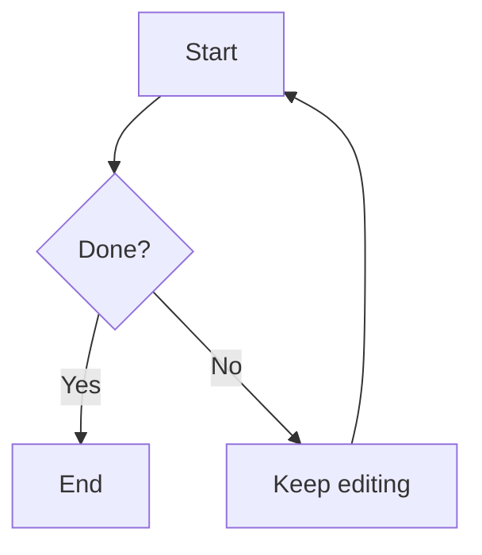
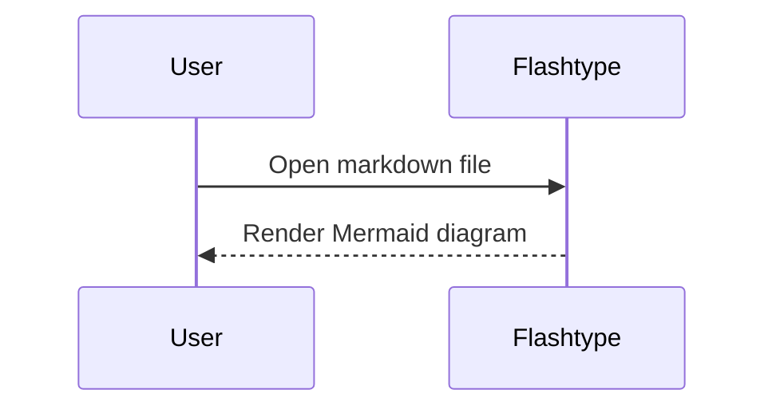

# Mermaid Demo

This document tests Mermaid diagram rendering in Flashtype.

```mermaid
graph TD
    A[Start] --> B{Done?}
    B -->|Yes| C[End]
    B -->|No| D[Keep editing]
    D --> A
```

## Sequence example

```mermaid
sequenceDiagram
    participant User
    participant Flashtype
    User->>Flashtype: Open markdown file
    Flashtype-->>User: Render Mermaid diagram
```
