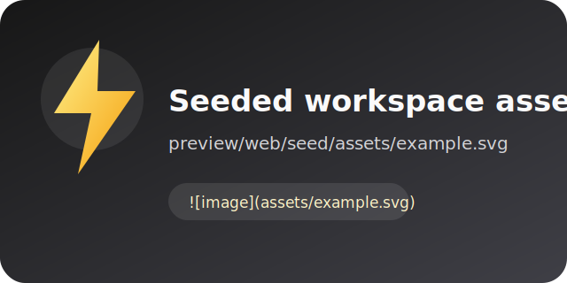

# GitHub Flavored Markdown visual test

> Cloudflare preview deployment test: this message only appears on the test PR.

This seeded document is a visual fixture for **Atelier's Markdown editor**. It
covers CommonMark plus the GitHub Flavored Markdown extensions: autolinks,
strikethrough, tables, and task lists.

## Headings

# Heading 1

## Heading 2

### Heading 3

#### Heading 4

##### Heading 5

###### Heading 6

Alternate heading one
=====================

Alternate heading two
---------------------

## Inline text

Plain text, _italic_, **bold**, _**bold italic**_, ~~strikethrough~~, and
**~~bold strikethrough~~**.

Use `inline code` alongside an escaped \*asterisk\*, an ampersand entity
(&amp;), and a literal backslash: `C:\Users\atelier`.

An ending backslash creates a hard line break.\
This text begins on the next line.

## Links, autolinks, and images

[Inline link](https://example.com "Example title") and a
[reference link][reference].

Autolinks: https://github.com/opral and <hello@example.com>.

The image below is stored alongside this README in the seeded workspace:



[reference]: https://commonmark.org

## Blockquotes

> A blockquote can contain **formatted text**.
>
> > Nested blockquotes are supported too.
>
> - Lists work inside quotes.
> - So do `inline code` spans.

## Lists

- Unordered item
- Unordered item with children
  - Nested item
    1. Deep ordered item
    2. Another deep item
- Final unordered item

1. Ordered item
2. Ordered item with a continuation paragraph

   The paragraph stays within item two.

3. Final ordered item

## Task lists

- [x] Completed task
- [ ] Incomplete task
- [x] Task with **formatting** and `code`
  - [ ] Nested task

## Table

| Left aligned |       Center aligned       | Right aligned |
| :----------- | :------------------------: | ------------: |
| Plain cell   |       **Bold cell**        |         1,024 |
| `code`       | [Link](https://github.com) |           $42 |
| ~~Removed~~  |      Emoji :sparkles:      |          100% |

## Code blocks

```ts
type WorkspaceFile = {
	path: string;
	contents: Uint8Array;
};

const readme: WorkspaceFile = {
	path: "/README.md",
	contents: new TextEncoder().encode("# Hello, GFM!"),
};
```

```json
{
	"fence": "tilde",
	"valid": true
}
```

    This is an indented code block.
    Its whitespace should be preserved.

## Thematic breaks

---

---

---

## Raw HTML

<details>
<summary>Expandable details</summary>

GFM allows raw HTML blocks. This section should expand and collapse.

</details>

<kbd>⌘</kbd> + <kbd>K</kbd> and H<sub>2</sub>O with x<sup>2</sup>.

## Edge cases

Paragraph containing a URL with punctuation: https://example.com/docs?q=gfm.

> [!NOTE]
> GitHub displays this syntax as an alert. Other CommonMark renderers may show
> it as a regular blockquote.

<!-- This comment should not render as visible text. -->

End of the GFM visual fixture.
